# EGRA and EGMA subtask variables {#ch06-egra-egma-subtask-variables}

## Introduction

The following tables provide descriptions and key information for the core and common subtasks of the Early Grade Reading Assessment (EGRA) and the Early Grade Mathematics Assessment (EGMA), as well as the additional subtasks included in the assessment surveys contained in the AHEAD harmonised dataset.

Although EGRA and EGMA are adapted to the language, curriculum, and educational context of each country, a common set of subtasks has become standard across most implementations. Many assessment programmes also include supplementary subtasks to measure additional literacy or numeracy skills or to address specific programme, curriculum, or research objectives. Accordingly, the AHEAD harmonised dataset includes both these widely implemented core subtasks and the additional subtasks administered in individual assessment studies.

The subtask descriptions have been compiled from available documentation and standardised to facilitate comparison across projects. Every effort has been made to ensure that the descriptions accurately reflect the original assessment instruments and administration procedures. However, they are based on the documentation currently available and may be revised as additional project documentation, assessment instruments, or technical manuals become available.

## Core and common EGRA subtasks

The Early Grade Reading Assessment (EGRA) is an individually administered assessment designed to measure the foundational reading skills that children develop during the early years of primary school. EGRA consists of a series of short subtasks that assess different components of reading development. Although the number and content of subtasks vary across languages and assessment programmes, they generally progress from foundational skills, such as letter-sound knowledge and word recognition, to more advanced skills, including oral reading fluency and reading comprehension.

The table below describes the core and common EGRA subtasks included in the AHEAD harmonised dataset. The variable name column presents the harmonised variable names used in the AHEAD dataset; individual assessment studies may use different variable names in their original datasets. Similarly, the timing limits reported for each subtask reflect the most common EGRA implementations. Individual studies may adopt different time limits, discontinuation rules, or administration procedures depending on the language, curriculum, and assessment design.

```{=html}
<div class="ahead-table-wrap">
<table class="ahead-data-table">
  <tr>
    <th>Task name</th>
    <th>Skill</th>
    <th>Description</th>
    <th>Variable name</th>
  </tr>
  <tr>
    <td>Letter name identification</td>
    <td>Alphabetic principle – decoding</td>
    <td>Learners are presented with a randomised series of upper- and/or lower-case letters and asked to orally identify each by name. Performance is scored for both accuracy and rate and reported as letter names correctly identified within 60 seconds (<code>letter_name_pm</code>).</td>
    <td><code>letter_name</code></td>
  </tr>
  <tr>
    <td>Letter sound identification</td>
    <td>Alphabetic principle – decoding</td>
    <td>Learners are presented with a randomised series of upper- and/or lower-case letters and asked to orally identify each by its corresponding sound. Performance is scored for both accuracy and rate and reported as letter sounds correctly identified within 60 seconds (<code>letter_sound_pm</code>).</td>
    <td><code>letter_sound</code></td>
  </tr>
  <tr>
    <td>Invented word reading</td>
    <td>Alphabetic principle – decoding</td>
    <td>Learners are presented with a written list of invented words that follow the phonological and orthographic rules of the language but are not real words. Learners read aloud as many as possible within 60 seconds. Performance is scored for both accuracy and rate and reported as correct invented words per minute (<code>invent_word_pm</code>).</td>
    <td><code>invent_word</code></td>
  </tr>
  <tr>
    <td>Oral reading fluency</td>
    <td>Reading fluency</td>
    <td>Learners read a grade-appropriate passage of approximately 50–60 words aloud as accurately and quickly as possible within 60 seconds. Performance is scored for both accuracy and rate and reported as correct words read per minute (<code>oral_read_pm</code>).</td>
    <td><code>oral_read</code></td>
  </tr>
  <tr>
    <td>Listening comprehension</td>
    <td>Listening comprehension / Oral language</td>
    <td>Learners listen to a short passage read aloud by the assessor and respond to a series of explicit and inferential comprehension questions. Responses are scored for accuracy.</td>
    <td><code>list_comp</code></td>
  </tr>
  <tr>
    <td>Familiar word reading</td>
    <td>Word recognition</td>
    <td>Learners are presented with a written list of 50 high-frequency, grade-appropriate words in isolation and asked to read aloud as many as possible within 60 seconds. Performance is scored for both accuracy and rate and reported as correct familiar words read per minute (<code>fam_word_pm</code>).</td>
    <td><code>fam_word</code></td>
  </tr>
  <tr>
    <td>Reading comprehension</td>
    <td>Reading comprehension</td>
    <td>Learners read a grade-appropriate passage silently or aloud and respond to comprehension questions. Responses are scored for accuracy.</td>
    <td><code>read_comp</code></td>
  </tr>
  <tr>
    <td>Vocabulary</td>
    <td>Oral vocabulary</td>
    <td>Learners are orally presented with a series of words and asked to identify their meanings, typically by pointing to the corresponding object, picture, or body part. Responses are scored for accuracy based on the number of correct vocabulary words identified.</td>
    <td><code>vocab_oral</code></td>
  </tr>
  <tr>
    <td>Initial sound identification</td>
    <td>Phoneme awareness</td>
    <td>Learners are orally presented with a word and asked to isolate and pronounce its first sound. Responses are scored for accuracy based on correct phoneme identification.</td>
    <td><code>pa_init_sound</code></td>
  </tr>
  <tr>
    <td>Different sound identification</td>
    <td>Phonemic awareness</td>
    <td>Learners listen to a series of spoken sounds, syllables, or words and identify the sound that is different from the others. Responses are scored for accuracy.</td>
    <td><code>pa_di_sound</code></td>
  </tr>
</table>
</div>
```

*Table 1: Core and common EGRA subtasks*

## Typical EGRA administration procedures

Although EGRA implementations vary across countries and languages, the core subtasks are generally administered individually by a trained assessor using a standardised administration protocol. Assessors follow scripted instructions, use standardised stimulus materials, and record learner responses according to predefined scoring rules. Although the administration procedures described below are common across many EGRA implementations, individual studies may differ in their timing limits, discontinuation rules, scoring procedures, and administration protocols.

Examples of the stimulus materials used for selected EGRA subtasks are provided below for illustrative purposes. These examples represent common task formats rather than the exact materials used in every assessment. Additional examples are available in the EGRA Toolkit (RTI International, 2016) and, where available, in the original assessment documentation for individual studies included in the AHEAD harmonised dataset.

### Letter name and sound identification

These subtasks are typically discontinued if the learner is unable to correctly identify any of the first ten letters (i.e., the first row of letters), although discontinuation rules may vary slightly across assessment programmes. The EGRA administrator times the learner for 60 seconds, recording the number of correctly identified letters as well as any errors made while the learner responds aloud.

```{r fig-letter-sound-wolof, echo=FALSE, fig.cap="Letter-sound identification subtask (Wolof language, Senegal). Source: RTI, 2016.", out.width="90%"}
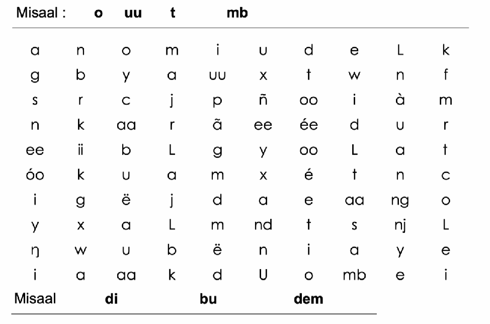
```

```{r fig-letter-sound-egrs, echo=FALSE, fig.cap="Letter-sound identification task, EGRS South Africa. Source: Department of Basic Education and the University of the Witwatersrand (2018).", out.width="90%"}
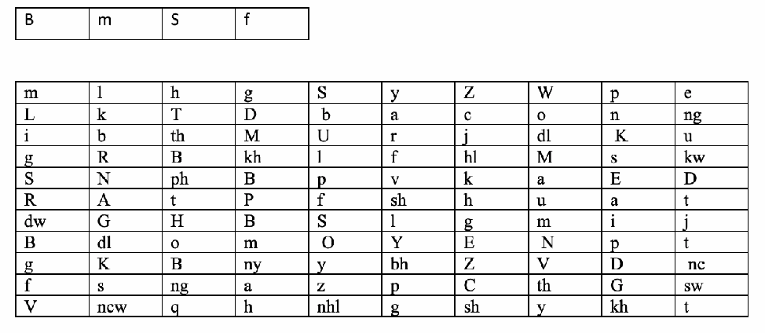
```

### Familiar and invented word reading

These subtasks are typically discontinued if the learner is unable to correctly read any of the first five words, although individual studies may use alternative discontinuation rules. The EGRA administrator times the learner for 60 seconds, recording the number of correctly read words and any reading errors. Examples of how these subtasks may be presented are shown below.

```{r fig-invented-word, echo=FALSE, fig.cap="Invented word reading (Icibemba language, Zambia). Source: RTI, 2016.", out.width="90%"}
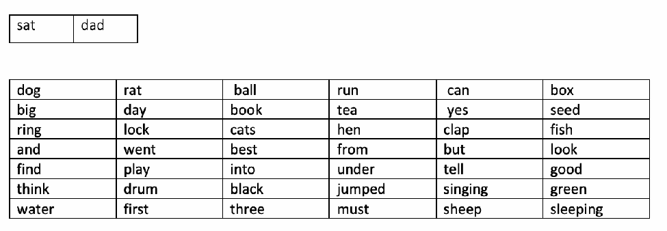
```

```{r fig-familiar-word, echo=FALSE, fig.cap="Familiar word reading task, EGRS South Africa. Source: Department of Basic Education and the University of the Witwatersrand (2018).", out.width="90%"}
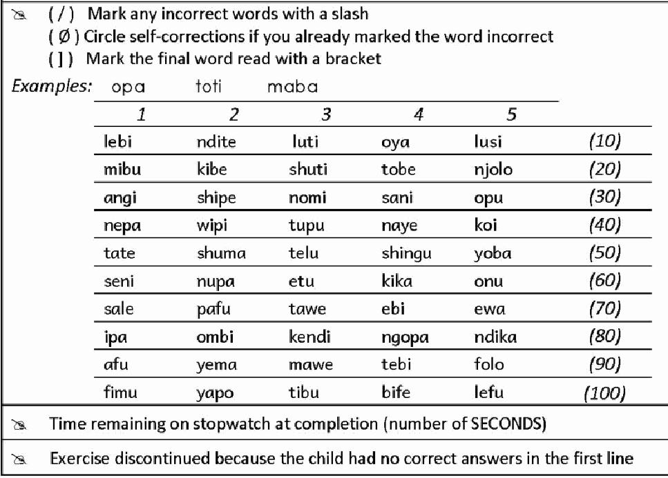
```

### Oral reading fluency and reading comprehension

The oral reading fluency subtask is typically discontinued if the learner is unable to correctly read any of the first line of the passage (generally around ten words). Most EGRA implementations administer this subtask for 60 seconds, although a small number of studies use alternative timing limits (e.g., three minutes). During administration, the assessor records the number of correctly read words and any reading errors.

The reading comprehension subtask is usually administered only if the learner attempts the oral reading passage. Depending on the assessment protocol, learners may or may not be permitted to refer back to the passage while answering the comprehension questions. Responses are scored for accuracy.

```{r fig-orf-comp, echo=FALSE, fig.cap="Oral reading fluency and reading comprehension subtask, EGRS South Africa. Source: Department of Basic Education and the University of the Witwatersrand (2018).", out.width="90%"}
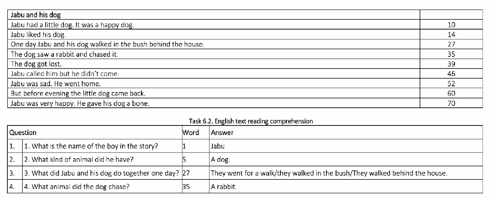
```

### Listening comprehension

```{r fig-listening-comp, echo=FALSE, fig.cap="Listening comprehension (English). Source: RTI, 2016.", out.width="90%"}
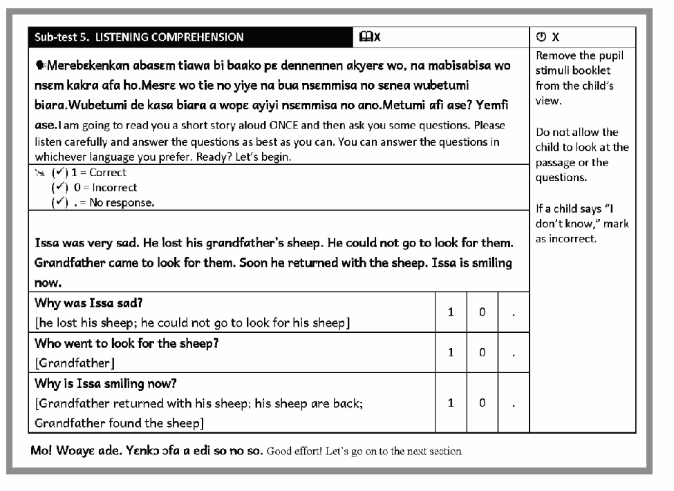
```

### Phoneme awareness

Phonemic awareness tasks vary across EGRA implementations but generally assess learners' ability to identify, isolate, or manipulate individual sounds in spoken words. Common subtasks include initial sound identification and initial sound discrimination, while some studies also include phoneme or syllable segmentation tasks. These subtasks are typically administered orally, are untimed, and responses are scored for accuracy.

```{r fig-phonemic-awareness, echo=FALSE, fig.cap="Phonemic awareness – initial sound identification (English). Source: RTI, 2016.", out.width="90%"}
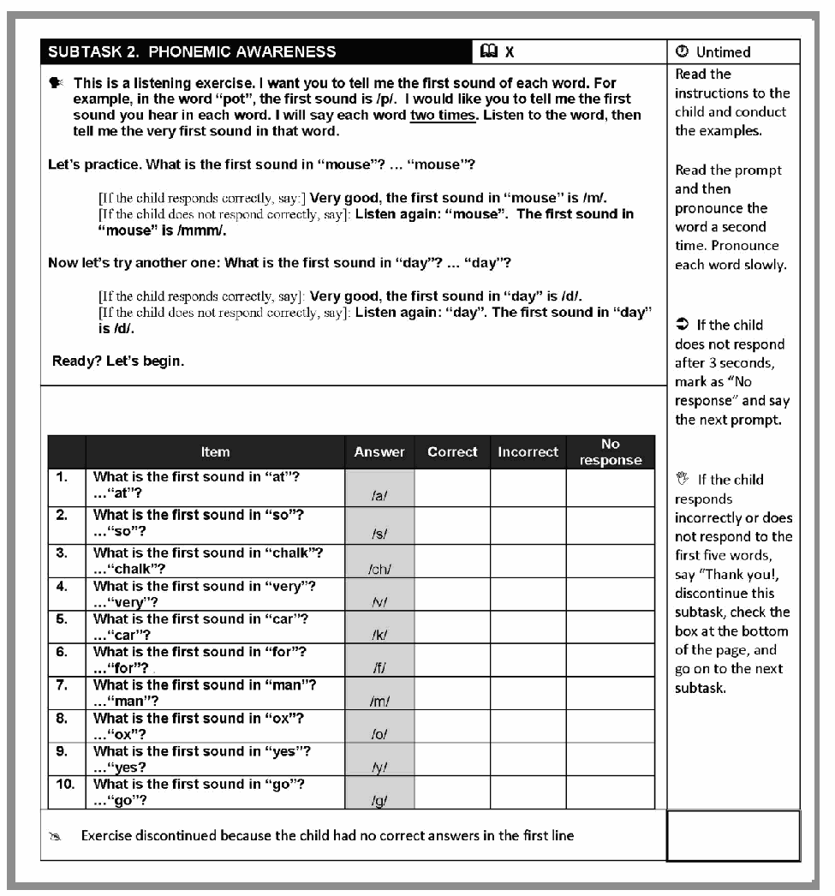
```

## Core EGMA tasks

The Early Grade Mathematics Assessment (EGMA) is an individually administered assessment designed to measure the foundational numeracy skills that children develop during the early years of primary school. EGMA consists of a series of short subtasks that assess different components of mathematical development, including number recognition, numerical magnitude, arithmetic, mathematical patterns, geometry, and problem solving.

As with EGRA, the specific subtasks vary across countries and assessment programmes to reflect local curricula, languages of instruction, and research objectives, although a common set of core subtasks has been adopted across many implementations.

The table below describes the core EGMA subtasks included in the AHEAD harmonised dataset. The variable name column presents the harmonised variable names used in the AHEAD dataset; individual assessment studies may use different variable names in their original datasets. Similarly, the timing limits reported for each subtask reflect the most common EGMA implementations. Individual studies may adopt different time limits, discontinuation rules, scoring procedures, or administration protocols depending on the assessment design.

```{=html}
<div class="ahead-table-wrap">
<table class="ahead-data-table">
  <tr>
    <th>Task name</th>
    <th>Skill</th>
    <th>Description</th>
    <th>Variable name</th>
  </tr>
  <tr>
    <td>Number identification</td>
    <td>Number competence</td>
    <td>Learners are presented with a series of numerals and asked to identify each number aloud.</td>
    <td><code>num_id</code></td>
  </tr>
  <tr>
    <td>Number discrimination</td>
    <td>Numerical magnitude</td>
    <td>Learners are presented with pairs of numbers and asked to identify the greater quantity.</td>
    <td><code>quant_comp</code></td>
  </tr>
  <tr>
    <td>Missing number</td>
    <td>Mathematical patterns</td>
    <td>Learners are presented with numerical sequences containing one missing value and asked to identify the missing number.</td>
    <td><code>miss_num</code></td>
  </tr>
  <tr>
    <td>Addition level 1</td>
    <td>Arithmetic</td>
    <td>Learners solve simple written addition problems of increasing difficulty within 60 seconds. Performance is scored for accuracy.</td>
    <td><code>addlvl1</code></td>
  </tr>
  <tr>
    <td>Subtraction level 1</td>
    <td>Arithmetic</td>
    <td>Learners solve simple written subtraction problems of increasing difficulty.</td>
    <td><code>sublvl1</code></td>
  </tr>
  <tr>
    <td>Addition level 2</td>
    <td>Arithmetic</td>
    <td>Learners solve more complex written addition problems.</td>
    <td><code>addlvl2</code></td>
  </tr>
  <tr>
    <td>Subtraction level 2</td>
    <td>Arithmetic</td>
    <td>Learners solve more complex written subtraction problems.</td>
    <td><code>sublvl2</code></td>
  </tr>
  <tr>
    <td>Word problems</td>
    <td>Arithmetic and mathematical reasoning</td>
    <td>Learners listen to or read short mathematics problems presented in everyday contexts and solve each problem.</td>
    <td><code>word_problem</code></td>
  </tr>
</table>
</div>
```

*Table 2: Core EGMA subtasks*

## Typical EGMA administration procedures

Although EGMA implementations vary across countries and assessment programmes, the core subtasks are generally administered individually by a trained assessor using a standardised administration protocol. Assessors follow scripted instructions, present standardised stimulus materials, and record learner responses according to predefined scoring procedures. While the administration procedures described below are common across many EGMA implementations, individual studies may differ in their discontinuation rules, administration procedures, scoring methods, and progression between subtasks.

Examples of the stimulus materials used for selected EGMA subtasks are provided below for illustrative purposes. These examples represent common task formats rather than the exact materials used in every assessment. Additional examples are available in the EGMA Toolkit (Platas et al., 2014) and, where available, in the original assessment documentation for individual studies included in the AHEAD harmonised dataset.

### Number identification and number discrimination

The tasks are typically untimed and are discontinued after four consecutive incorrect responses. Responses are scored for accuracy.

```{r fig-num-id, echo=FALSE, fig.cap="Number identification subtask. Source: Platas et al., 2014.", out.width="60%"}
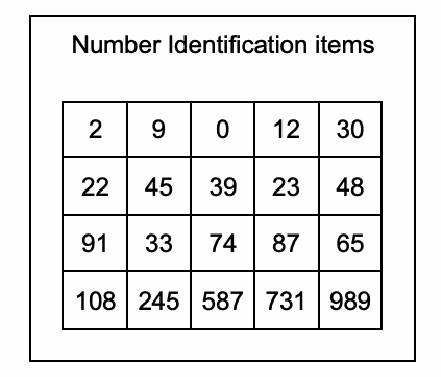
```

```{r fig-num-disc, echo=FALSE, fig.cap="Number discrimination subtask. Source: Platas et al., 2014.", out.width="60%"}
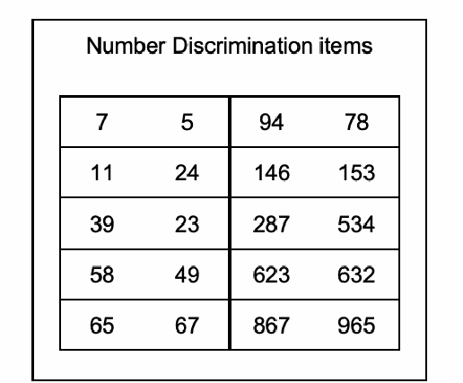
```

### Missing number and addition and subtraction level 1

In a standard EGMA administration, the missing number subtask is timed for 60 seconds, although adaptations may use different timing limits. Assessors record the accuracy of learners' responses.

The addition level 1 and subtraction level 1 subtasks are each administered for 60 seconds, although adaptations may use different timing limits. Assessors record both the accuracy of learners' responses and, where applicable, the problem-solving strategy used (e.g., mental calculation, fingers or tick marks, or paper and pencil). The subtraction level 1 subtask is generally administered only to learners who successfully complete the preceding addition level 1 subtask, with learners scoring zero on addition level 1 typically not progressing to this task.

```{r fig-add-sub-l1, echo=FALSE, fig.cap="Simple addition and subtraction subtask. Source: Platas et al., 2014.", out.width="60%"}
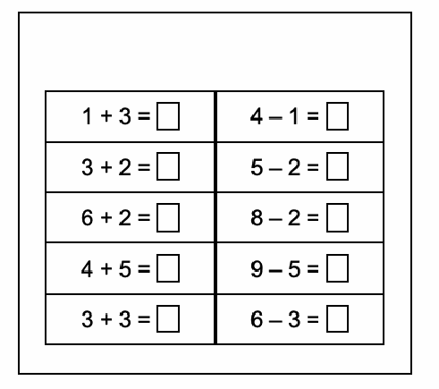
```

```{r fig-missing-number, echo=FALSE, fig.cap="Missing number subtask. Source: Platas et al., 2014.", out.width="60%"}
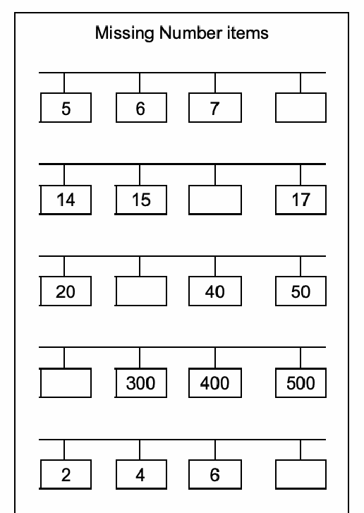
```

### Addition level 2 and subtraction level 2

These subtasks assess more advanced arithmetic skills involving multi-digit calculations. In standard EGMA administrations, each task is administered for 60 seconds, although adaptations may use different timing limits. Assessors record both the accuracy of learners' responses and, where applicable, the problem-solving strategy used (e.g., mental calculation, fingers or tick marks, or paper and pencil). The addition level 2 subtask is generally administered only to learners who successfully complete the preceding subtraction level 1 subtask.

```{r fig-add-sub-l2, echo=FALSE, fig.cap="Addition and subtraction level 2 subtask. Source: Platas et al., 2014.", out.width="60%"}
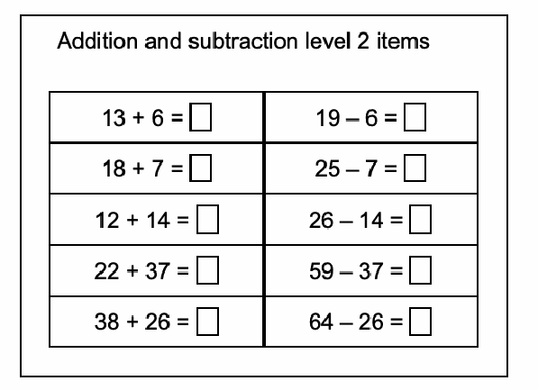
```

### Word problems

The assessor reads each problem aloud while the learner listens and provides an oral response. Learners may use mental calculation, fingers or tick marks, or paper and pencil to solve the problems, and assessors record both the accuracy of responses and, where applicable, the problem-solving strategy used. The task is typically untimed and responses are scored for accuracy.

```{r fig-word-problems, echo=FALSE, fig.cap="Word problems subtask. Source: Platas et al., 2014.", out.width="90%"}
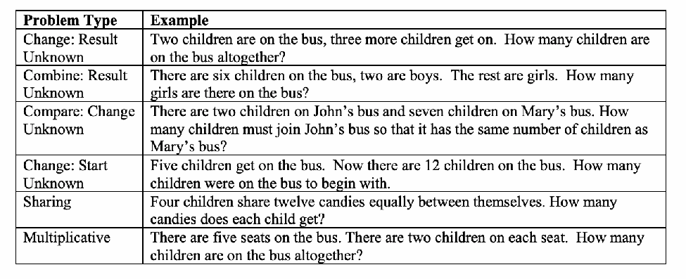
```

## Additional (non-core) EGRA and EGMA subtasks

Additional (non-core) subtasks are included in some EGRA and EGMA implementations to assess literacy and numeracy skills beyond the standard core assessment framework or to address specific programme, curriculum, or research objectives. These subtasks vary across studies in their content, administration, and scoring and are therefore not administered consistently across all assessments. The descriptions below summarise the common characteristics of each supplementary subtask across the assessment studies included in the AHEAD harmonised dataset. The variable name column presents the harmonised variable names used in the AHEAD dataset; individual assessment studies may use different variable names in their original datasets.

```{=html}
<div class="ahead-table-wrap">
<table class="ahead-data-table">
  <tr>
    <th>Task name</th>
    <th>Skill</th>
    <th>Description</th>
    <th>Variable name</th>
  </tr>
  <tr>
    <td>Differential initial sound</td>
    <td>Phonemic awareness</td>
    <td>Learners are orally presented with a set of words and asked to identify the word that begins with a different initial sound. Responses are scored for accuracy based on correct identification of the differing initial phoneme.</td>
    <td><code>pa_df_init_snd</code></td>
  </tr>
  <tr>
    <td>Receptive listening comprehension</td>
    <td>Listening comprehension</td>
    <td>Learners listen to words, sentences, or short passages presented orally by the assessor and demonstrate comprehension by selecting, pointing to, or indicating the correct response.</td>
    <td><code>receptive_listen</code></td>
  </tr>
  <tr>
    <td>Written comprehension</td>
    <td>Written comprehension</td>
    <td>Learners read written text independently and respond to questions or complete tasks that assess their understanding of the text. Responses are scored for accuracy.</td>
    <td><code>written_comp</code></td>
  </tr>
  <tr>
    <td>Phoneme combined</td>
    <td>Phonemic awareness</td>
    <td>Learners complete one or more phonemic awareness tasks, including identifying, segmenting, blending, adding, deleting, or substituting individual phonemes in spoken words without reference to print. Responses are scored for accuracy.</td>
    <td><code>phoneme_combined</code></td>
  </tr>
  <tr>
    <td>Creative writing</td>
    <td>Written composition</td>
    <td>Learners produce original written text in response to a prompt or stimulus. Responses are assessed using predefined scoring criteria that may include organisation and development of ideas, vocabulary, language use, spelling, grammar, and writing conventions.</td>
    <td><code>creative_writing</code></td>
  </tr>
  <tr>
    <td>Untimed oral reading</td>
    <td>Connected text reading</td>
    <td>Learners read a grade-appropriate passage aloud as accurately as possible without a time limit. Performance is scored for reading accuracy, and in some assessments additional measures such as errors or total words read may also be recorded.</td>
    <td><code>unt_oral_read</code></td>
  </tr>
  <tr>
    <td>Word dictation</td>
    <td>Writing</td>
    <td>Learners listen to individual words read aloud by the assessor and write each word.</td>
    <td><code>dict_word</code></td>
  </tr>
  <tr>
    <td>Sentence dictation</td>
    <td>Writing</td>
    <td>Learners listen to sentences read aloud by the assessor and write each sentence.</td>
    <td><code>dict_sent</code></td>
  </tr>
  <tr>
    <td>Untimed reading comprehension</td>
    <td>Reading comprehension</td>
    <td>Learners read a grade-appropriate passage and respond to comprehension questions without a time limit. Responses are scored for accuracy. Learners may or may not be permitted to refer back to the passage depending on the assessment protocol.</td>
    <td><code>unt_read_comp</code></td>
  </tr>
  <tr>
    <td>Silly sentences</td>
    <td>Sentence comprehension</td>
    <td>Learners read a series of simple sentences and determine whether each sentence is meaningful or nonsensical. Responses are scored for accuracy based on correct identification of meaningful and nonsensical sentences.</td>
    <td><code>silly_sentence</code></td>
  </tr>
</table>
</div>
```

*Table 3: Additional (non-core) EGRA subtasks*

```{=html}
<div class="ahead-table-wrap">
<table class="ahead-data-table">
  <tr>
    <th>Task name</th>
    <th>Skill</th>
    <th>Description</th>
    <th>Variable name</th>
  </tr>
  <tr>
    <td>Written addition</td>
    <td>Arithmetic</td>
    <td>Learners solve written addition problems of increasing difficulty. Responses are scored for accuracy based on the number of correctly solved items.</td>
    <td><code>we_add</code></td>
  </tr>
  <tr>
    <td>Written subtraction</td>
    <td>Arithmetic</td>
    <td>Learners solve written subtraction problems of increasing difficulty. Responses are scored for accuracy based on the number of correctly solved items.</td>
    <td><code>we_sub</code></td>
  </tr>
  <tr>
    <td>Written multiplication</td>
    <td>Arithmetic</td>
    <td>Learners solve written multiplication problems involving single- and/or multi-digit whole numbers. Responses are scored for accuracy based on the number of correctly solved items.</td>
    <td><code>we_mult</code></td>
  </tr>
  <tr>
    <td>Written division</td>
    <td>Arithmetic</td>
    <td>Learners solve written division problems involving whole numbers. Responses are scored for accuracy based on the number of correctly solved items.</td>
    <td><code>we_div</code></td>
  </tr>
  <tr>
    <td>Multiplication</td>
    <td>Arithmetic</td>
    <td>Learners solve multiplication problems involving single- and/or multi-digit whole numbers. Responses are scored for accuracy based on the number of correctly solved items.</td>
    <td><code>mult</code></td>
  </tr>
  <tr>
    <td>Fractions</td>
    <td>Arithmetic</td>
    <td>Learners identify, compare, represent, and solve problems involving fractions. Responses are scored for accuracy based on the number of correctly solved items.</td>
    <td><code>frac</code></td>
  </tr>
  <tr>
    <td>Shape identification</td>
    <td>Geometry</td>
    <td>Learners identify and name common two- and/or three-dimensional geometric shapes. Responses are scored for accuracy based on the number of correctly identified shapes.</td>
    <td><code>shape_id</code></td>
  </tr>
</table>
</div>
```

*Table 4: Additional (non-core) EGMA subtasks*

## EGRA and EGMA subtask naming conventions

Every EGRA/EGMA subtask shares a subtask stem; individual fields add an item number or metric suffix. Within each subtask stem, you will typically find:

```{=html}
<div class="ahead-table-wrap">
<table class="ahead-data-table">
  <tr>
    <th>Field type</th>
    <th>Pattern</th>
    <th>Examples</th>
  </tr>
  <tr>
    <td>Item-level</td>
    <td><code>{subtask_stem}_{n}</code></td>
    <td><code>letter_sound_1</code>, <code>num_id_3</code></td>
  </tr>
  <tr>
    <td>Subtask summary</td>
    <td><code>{subtask_stem}_{metric_suffix}</code></td>
    <td><code>oral_read_score</code>, <code>oral_read_pm</code>, <code>fam_word_time_remain</code></td>
  </tr>
</table>
</div>
```

*Table 5: EGRA/EGMA subtask naming conventions*

The full set of metric suffixes is shown in the table below.

```{=html}
<div class="ahead-table-wrap">
<table class="ahead-data-table">
  <tr>
    <th>Metric suffix</th>
    <th>Description</th>
    <th>Timed tasks</th>
    <th>Untimed tasks</th>
  </tr>
  <tr>
    <td><code>_score</code></td>
    <td>Raw score</td>
    <td>all</td>
    <td>all</td>
  </tr>
  <tr>
    <td><code>_pm</code></td>
    <td>Correct items per minute</td>
    <td>all</td>
    <td>—</td>
  </tr>
  <tr>
    <td><code>_score_pcnt</code></td>
    <td>Percent correct</td>
    <td>—</td>
    <td>all</td>
  </tr>
  <tr>
    <td><code>_attempted</code></td>
    <td>Items attempted</td>
    <td>all</td>
    <td>reading comprehension</td>
  </tr>
  <tr>
    <td><code>_attempted_pcnt</code></td>
    <td>Percent correct of items attempted</td>
    <td>all</td>
    <td>reading comprehension</td>
  </tr>
  <tr>
    <td><code>_score_zero</code></td>
    <td>Indicator: score equals zero</td>
    <td>all</td>
    <td>all</td>
  </tr>
  <tr>
    <td><code>_time_remain</code></td>
    <td>Time remaining (seconds)</td>
    <td>all</td>
    <td>—</td>
  </tr>
  <tr>
    <td><code>_auto_stop</code></td>
    <td>Auto-stop rule triggered</td>
    <td>all</td>
    <td>—</td>
  </tr>
  <tr>
    <td><code>_max</code></td>
    <td>Maximum items in subtask</td>
    <td>all</td>
    <td>all</td>
  </tr>
  <tr>
    <td><code>_time_allowed</code></td>
    <td>Time allowed (seconds)</td>
    <td>all</td>
    <td>—</td>
  </tr>
</table>
</div>
```

*Table 6: Standard metric suffixes*

Item-level variables use the `corr` value-label family in the DDI codebook (typically 0 = Incorrect, 1 = Correct, with non-response codes).

Summary metrics (scores, rates, times) are usually continuous and unlabelled.

All variable-level codes and labels are documented in the portal DDI codebook.

## References

Department of Basic Education, & University of the Witwatersrand. (2018). *Grade 2 learner assessment (Early Grade Reading Study II, Wave 3)* [Assessment instrument]. DataFirst, University of Cape Town. https://doi.org/10.25828/yczq-az61

Platas, L. M., Ketterlin-Geller, L. R., Brombacher, A., & Sitabkhan, Y. (2014). *Early Grade Mathematics Assessment (EGMA) toolkit*. RTI International.

RTI International. (2016). *Early Grade Reading Assessment (EGRA) toolkit* (2nd ed.). United States Agency for International Development.
